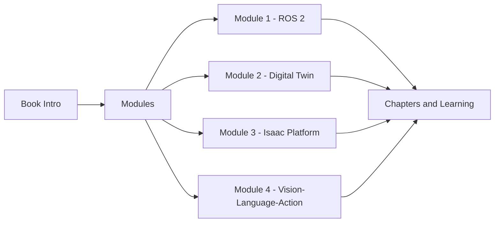

# Physical AI & Humanoid Robotics: A Comprehensive Guide

Welcome to the comprehensive guide on building AI-powered humanoid robots from simulation to reality. This book is designed to take you through the essential technologies and concepts needed to develop intelligent robotic systems.

## About This Book

This book is structured into four comprehensive modules, each focusing on critical aspects of humanoid robotics development:

import DocCardList from '@theme/DocCardList';
import {useCurrentSidebarCategory} from '@docusaurus/theme-common';

<DocCardList items={[
  {
    label: 'Module 1 – ROS 2: The Robotic Nervous System',
    description: 'Learn the Robot Operating System fundamentals for controlling humanoid robots.',
    href: '/docs/module-1-ros2/intro',
  },
  {
    label: 'Module 2 – Digital Twin (Gazebo & Unity)',
    description: 'Master simulation environments for testing humanoid robots safely.',
    href: '/docs/module-2-digital-twin/intro',
  },
  {
    label: 'Module 3 – NVIDIA Isaac Platform',
    description: 'Explore NVIDIA\'s platform for AI-powered robotics development.',
    href: '/docs/module-3-isaac/intro',
  },
  {
    label: 'Module 4 – Vision-Language-Action',
    description: 'Combine perception, reasoning, and action for intelligent robot behavior.',
    href: '/docs/module-4-vla/intro',
  },
]}/>

## Read the Book

[Read the Book →](./docs/intro)

