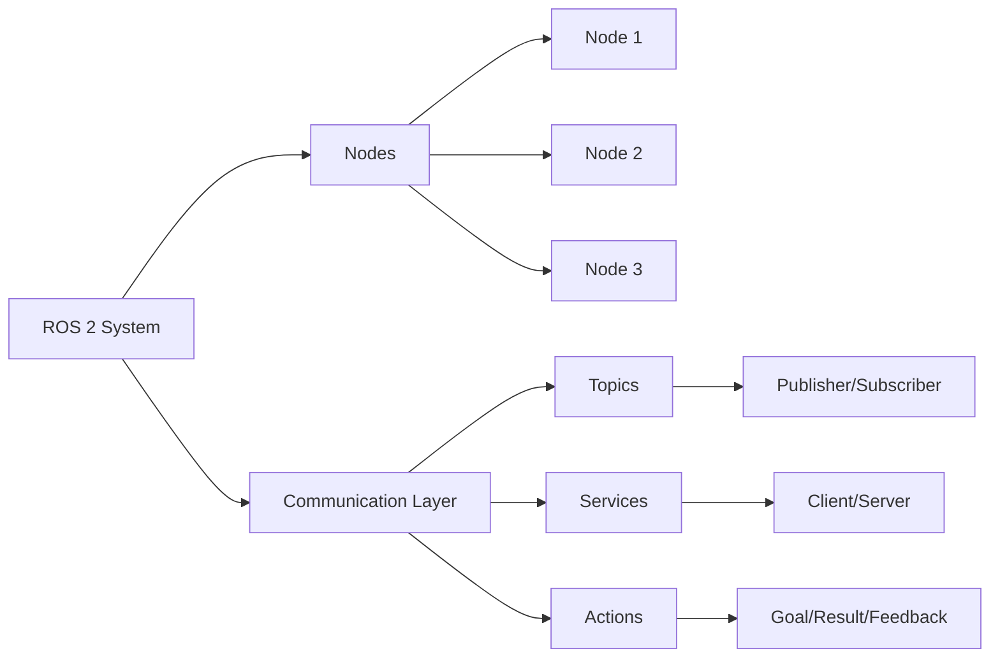

# ROS 2 Basics: Core Concepts

This chapter delves into the foundational concepts of ROS 2, essential for building robust robotic applications.
We will cover the basic building blocks, including nodes, topics, services, and actions, which form the communication backbone of any ROS 2 system.
Understanding these concepts is crucial for effective humanoid robot programming.

- Nodes: fundamental processing units
- Topics: asynchronous data streaming
- Services: synchronous request-response communication
- Actions: long-running, goal-oriented tasks

