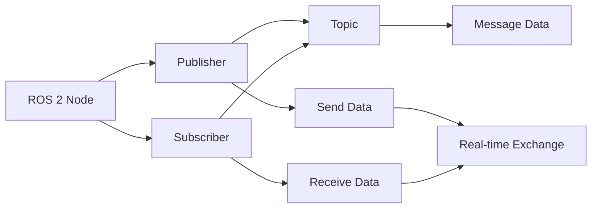

# ROS 2 Nodes and Topics

This chapter focuses on two fundamental ROS 2 communication mechanisms: nodes and topics.
Nodes are modular processing units, while topics provide a publish-subscribe messaging system for real-time data exchange.
Mastering these concepts is crucial for building distributed robotic applications.

- Understanding ROS 2 nodes
- Implementing publishers and subscribers
- Data types and message definitions
- Best practices for topic communication

