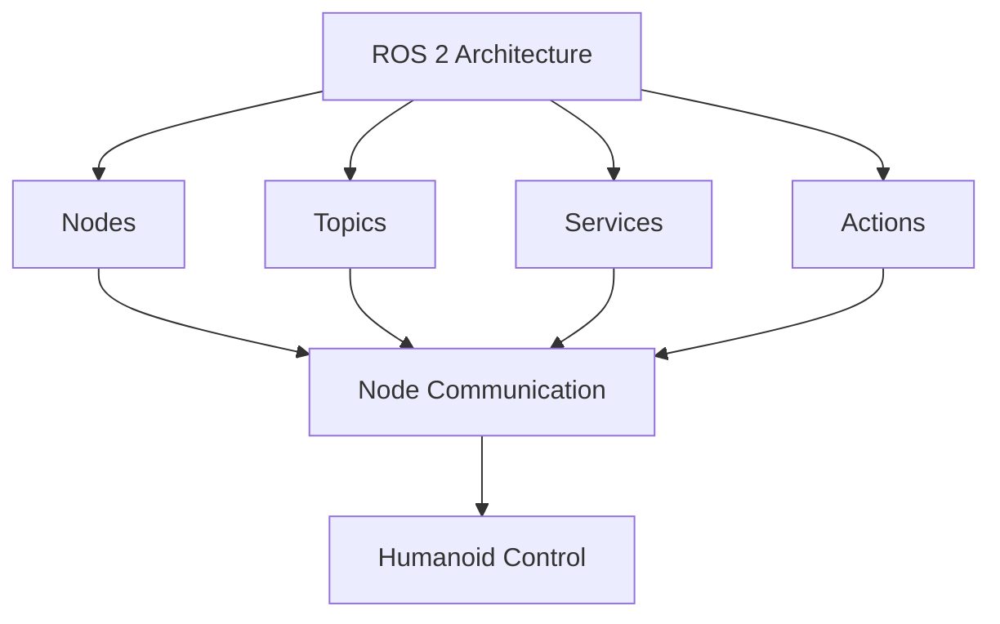

# Module 1 – ROS 2: The Robotic Nervous System

This module provides a foundational understanding of the Robot Operating System 2 (ROS 2) and its role as the nervous system for robotic applications. We will explore its core concepts, architecture, and how it facilitates the development of complex robotic applications, particularly for humanoid robots.

## Learning Outcomes

By the end of this module, you will be able to:
- Understand the fundamental concepts of ROS 2 architecture
- Implement basic ROS 2 nodes, topics, services, and actions
- Set up a complete ROS 2 development environment
- Design communication patterns between robotic components
- Apply ROS 2 principles to humanoid robot control systems

## Chapter List

This module contains the following chapters:
- Chapter 1: ROS Basics - Understanding the fundamentals of Robot Operating System
- Chapter 2: Nodes and Topics - Mastering communication between robotic components
- Chapter 3: RCLPY Agents - Programming robotic behaviors with Python
- Chapter 4: URDF for Humanoids - Creating robot descriptions for humanoid systems

## Overview

The Robot Operating System 2 (ROS 2) serves as the foundational middleware for developing complex robotic applications. This module introduces you to the core concepts that will enable you to build sophisticated humanoid robots with distributed sensing, processing, and control capabilities.

