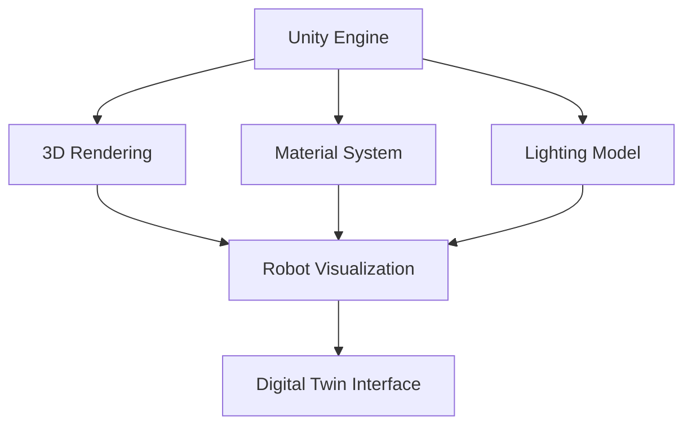

# Unity Visualization: High-Fidelity Digital Twins

This chapter explores how to leverage Unity, a powerful real-time 3D development platform, to create high-fidelity visualizations for our digital twins.
We will cover importing robot models and environments from Gazebo, enhancing visual realism with materials and lighting, and setting up interactive scenes.
Unity is crucial for generating compelling simulations and user interfaces for humanoid robot development.

- Importing Gazebo models into Unity
- Enhancing visual realism: materials, textures, lighting
- Creating interactive scenes and environments
- Integrating Unity with ROS 2 for real-time control

