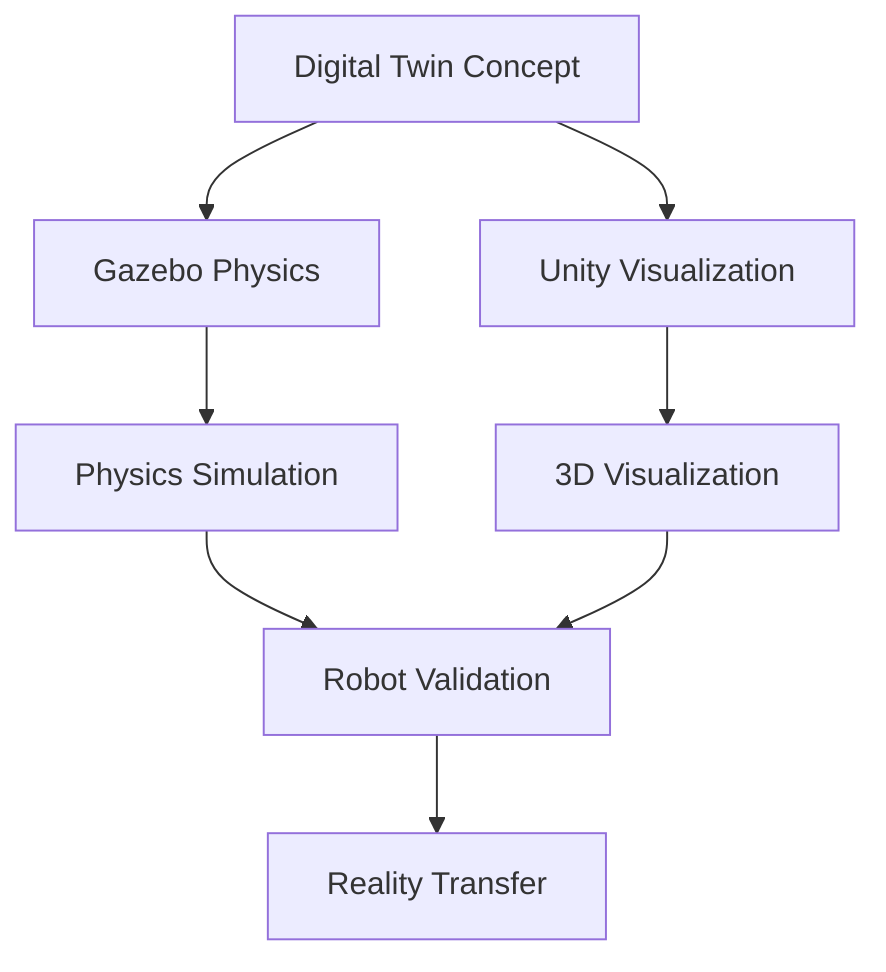

# Module 2 – Digital Twin (Gazebo & Unity)

This module introduces the concept of digital twins and their critical role in robotics development.
We will explore how to create realistic virtual environments using Gazebo for physics-based simulation
and Unity for high-fidelity visualization. Understanding digital twins is essential for
safe, efficient, and cost-effective development of humanoid robots before deployment to the real world.

## Learning Outcomes

By the end of this module, you will be able to:
- Design and implement physics-based simulations using Gazebo
- Create high-fidelity visualizations with Unity for robotics
- Integrate sensor simulation for realistic perception
- Establish simulation-to-reality pipelines for humanoid robots
- Validate robotic behaviors in virtual environments before real-world deployment

## Chapter List

This module contains the following chapters:
- Chapter 1: Gazebo Physics - Mastering physics simulation for robotic applications
- Chapter 2: Unity Visualization - Creating immersive 3D environments for robots
- Chapter 3: Sensor Simulation - Implementing realistic sensor models for perception

## Overview

Digital twins provide a crucial bridge between simulation and reality in robotics development. This module covers the essential tools and techniques needed to create effective virtual environments for humanoid robot development.

