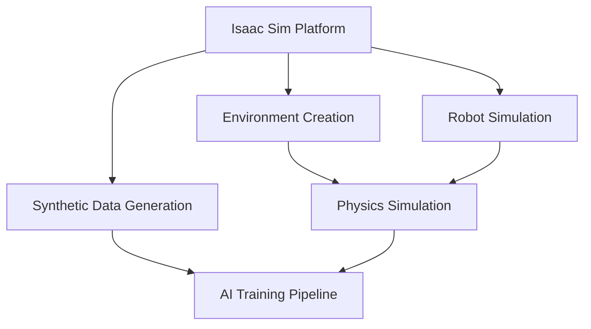

# Isaac Sim: Advanced Robotics Simulation

Discover NVIDIA Isaac Sim, a scalable and physically accurate robotics simulation platform. Learn to create virtual environments, simulate robots, and generate synthetic data for AI training.

- Understanding Isaac Sim architecture and capabilities
- Creating realistic virtual environments for humanoid robots
- Configuring physics properties and materials
- Generating synthetic data for AI model training
- Integrating with existing ROS 2 workflows

