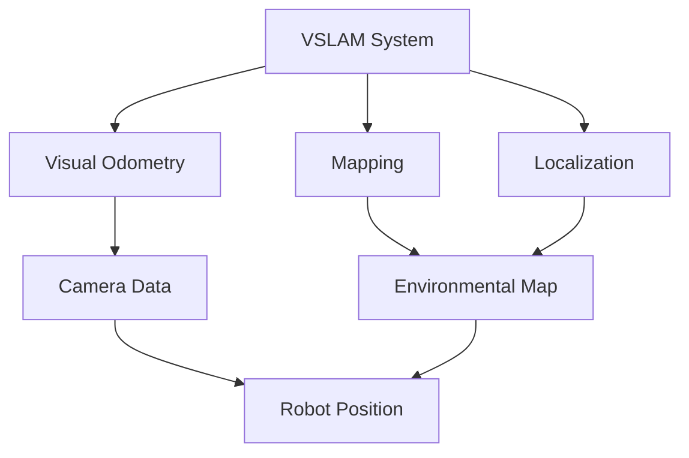

# VSLAM: Visual Simultaneous Localization and Mapping

Delve into Visual SLAM (Simultaneous Localization and Mapping) using Isaac ROS. Understand how robots build maps of their environment while simultaneously tracking their own position.

- Understanding VSLAM algorithms and principles
- Implementing visual odometry for humanoid robots
- Creating and maintaining environmental maps
- Optimizing localization accuracy and performance
- Integrating VSLAM with navigation systems

