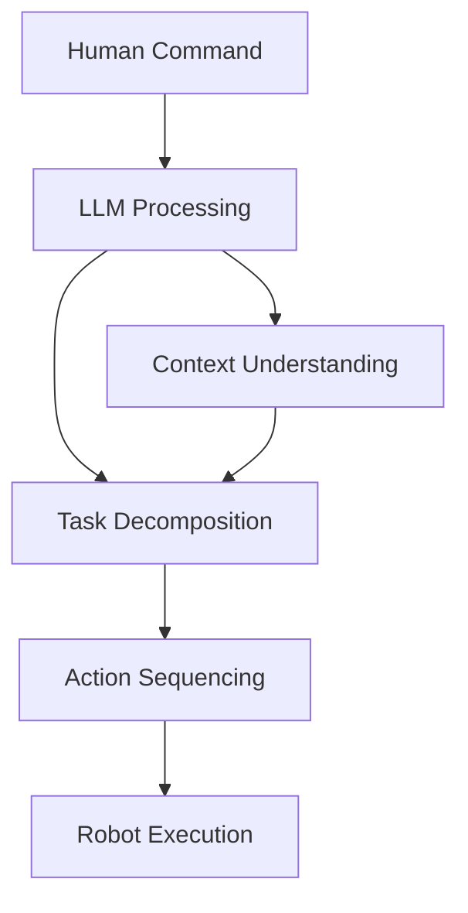

# LLM Planning: Large Language Models for Robotic Task Planning

Discover how Large Language Models (LLMs) can be leveraged for high-level task planning and symbolic reasoning, translating human intent into robot actions.

- Understanding LLM integration with robotic systems
- Designing prompt engineering for robotic tasks
- Implementing task decomposition and planning
- Handling ambiguous or complex commands
- Validating plans for safety and feasibility

