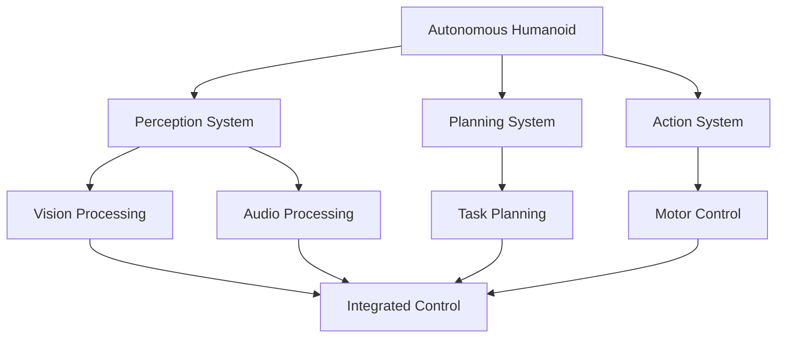

# Capstone: Autonomous Humanoid Project

This capstone chapter integrates all learned concepts to build an autonomous humanoid robot. It covers advanced VLA techniques for complex, real-world interactions.

- Integrating all modules into a cohesive system
- Implementing multimodal perception and control
- Designing autonomous behaviors and decision-making
- Testing and validation of the complete system
- Preparing for real-world deployment

