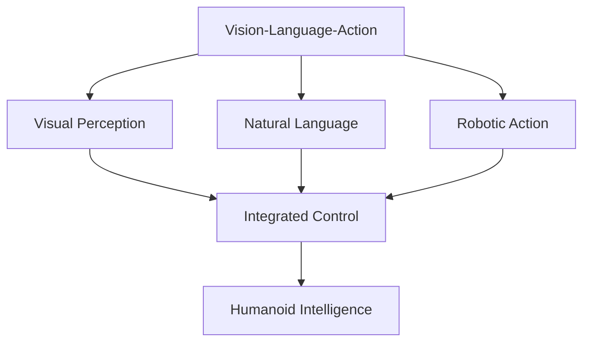

# Module 4 – Vision-Language-Action

This module explores Vision-Language-Action (VLA) models, integrating visual perception and natural language understanding for complex robotic task planning and execution.

## Learning Outcomes

By the end of this module, you will be able to:
- Implement Vision-Language-Action models for robotic applications
- Integrate multimodal perception for humanoid robot control
- Apply natural language processing for robot task planning
- Combine perception, reasoning, and action for intelligent behavior
- Develop end-to-end systems for autonomous humanoid capabilities

## Chapter List

This module contains the following chapters:
- Chapter 1: Whisper - Speech recognition and processing for robot interaction
- Chapter 2: LLM Planning - Large language models for robotic task planning
- Chapter 3: Capstone - Autonomous humanoid project integrating all modules

## Overview

Vision-Language-Action models represent the cutting edge of robotic intelligence, enabling robots to perceive their environment, understand natural language commands, and execute complex actions. This module integrates all previous knowledge into a comprehensive humanoid robotics system.

