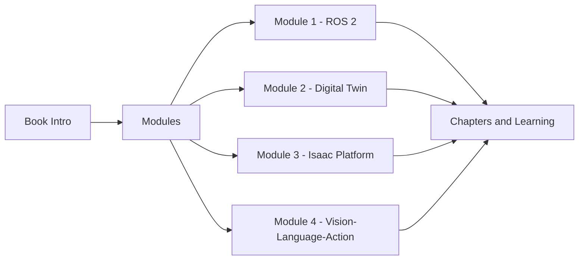

# Physical AI & Humanoid Robotics: A Comprehensive Guide

Welcome to the comprehensive guide on building AI-powered humanoid robots from simulation to reality. This book is designed to take you through the essential technologies and concepts needed to develop intelligent robotic systems.

## About This Book

This book is structured into four comprehensive modules, each focusing on critical aspects of humanoid robotics development:

## Read the Book

[Read the Book →](/docs/module-1-ros2/intro)

