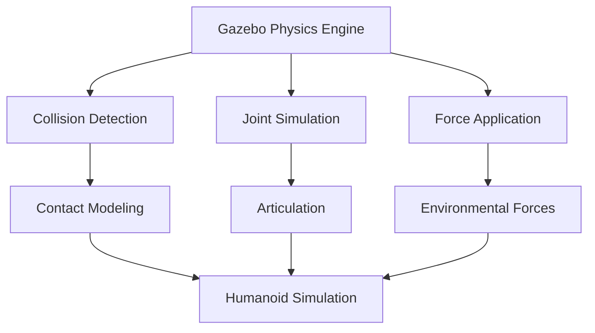

# Gazebo Physics: Realistic Robot Simulation

This chapter focuses on using Gazebo, a powerful 3D robotics simulator, to create realistic physics-based environments for humanoid robots.
We will cover setting up Gazebo, importing robot models (URDF/SDF), defining physics properties, and simulating sensor data.
Mastering Gazebo is key to accurately testing robot behaviors in a safe, virtual space.

- Setting up Gazebo simulation environment
- Importing and configuring URDF/SDF robot models
- Defining physics parameters: gravity, friction, contacts
- Simulating sensors: cameras, LiDAR, IMU

