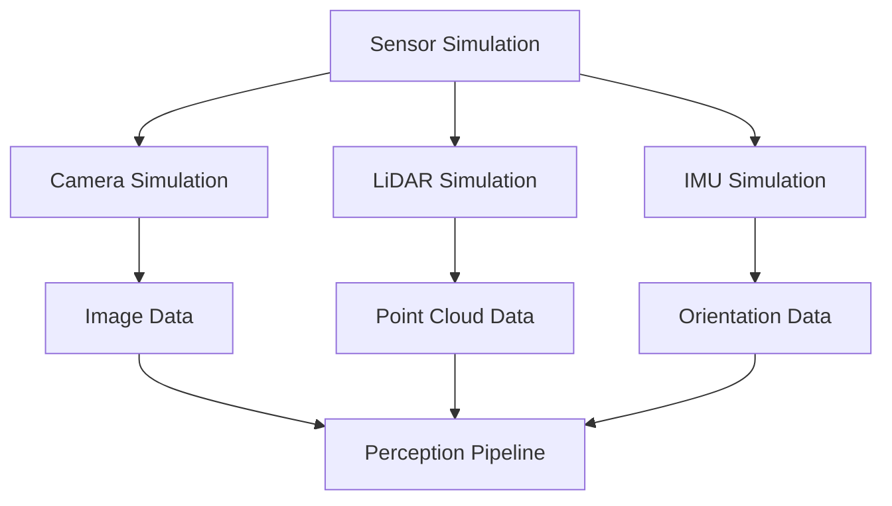

# Sensor Simulation: Perceiving the Virtual World

This chapter focuses on the crucial aspect of sensor simulation within digital twins, enabling humanoid robots to perceive and interact with their virtual environments.
We will cover the theory and practical implementation of simulating various sensors, including cameras, LiDAR, and IMUs, within both Gazebo and Unity.
Accurate sensor data is vital for developing robust perception and navigation algorithms for physical robots.

- Principles of sensor simulation
- Simulating cameras and image processing
- Simulating LiDAR and point cloud generation
- Simulating IMU and other proprioceptive sensors

