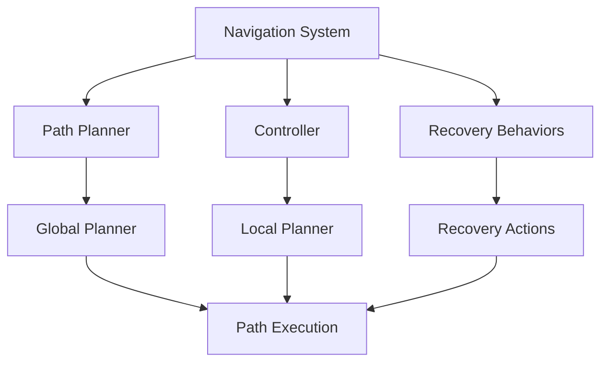

# Navigation (Nav2): Path Planning and Autonomous Movement

Master robot navigation with Nav2 on the Isaac platform. This chapter covers path planning, obstacle avoidance, and autonomous movement in complex environments.

- Understanding Nav2 architecture and components
- Configuring path planners for humanoid robots
- Implementing obstacle detection and avoidance
- Tuning navigation parameters for optimal performance
- Integrating with perception systems for dynamic navigation

