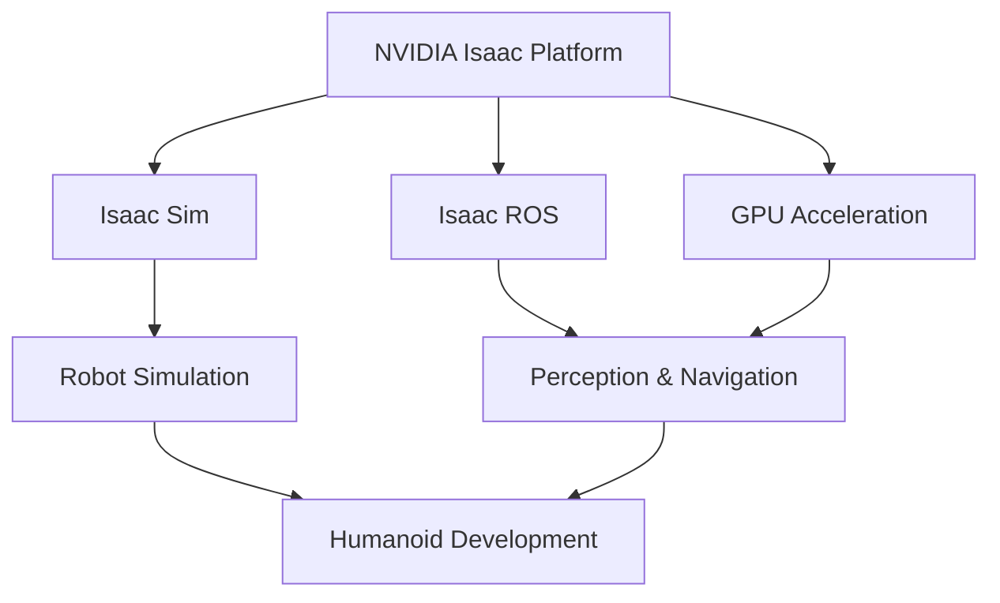

# Module 3 – NVIDIA Isaac Platform

This module provides an introduction to the NVIDIA Isaac platform, a comprehensive suite of tools for robotics development, simulation, and AI.
We will explore Isaac Sim for realistic simulation and Isaac ROS for accelerating robotic perception and navigation workflows.
Understanding this platform is essential for developing advanced, AI-powered humanoid robots.

## Learning Outcomes

By the end of this module, you will be able to:
- Configure and utilize NVIDIA Isaac Sim for robotic simulation
- Implement Isaac ROS components for perception and navigation
- Leverage GPU acceleration for robotic AI applications
- Integrate Isaac tools with existing ROS 2 workflows
- Apply Isaac platform capabilities to humanoid robot development

## Chapter List

This module contains the following chapters:
- Chapter 1: Isaac Sim - Advanced simulation for robotic applications
- Chapter 2: VSLAM - Visual Simultaneous Localization and Mapping techniques
- Chapter 3: Navigation (Nav2) - Path planning and autonomous navigation systems

## Overview

The NVIDIA Isaac platform provides powerful tools for developing AI-powered robots with advanced perception and navigation capabilities. This module covers the essential components needed to leverage GPU acceleration for humanoid robotics.

