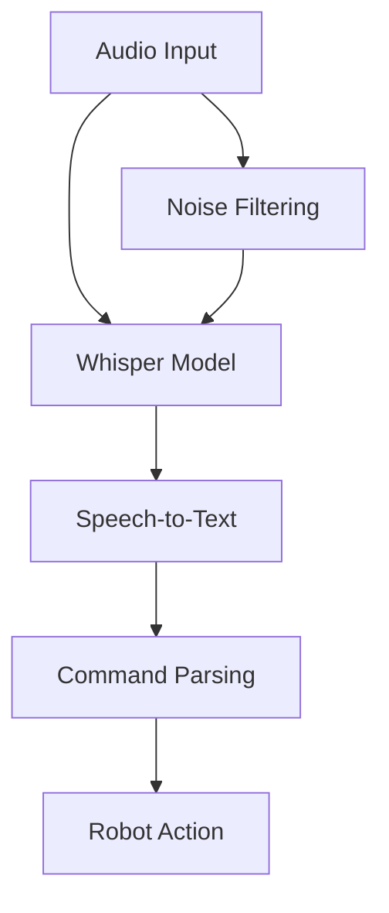

# Whisper: Speech Recognition for Robot Interaction

Learn to integrate OpenAI Whisper for robust speech-to-text capabilities, enabling robots to understand spoken commands and environmental audio cues.

- Understanding Whisper architecture and capabilities
- Integrating Whisper with robotic systems
- Processing real-time audio streams
- Handling noise and environmental challenges
- Converting speech to actionable commands

